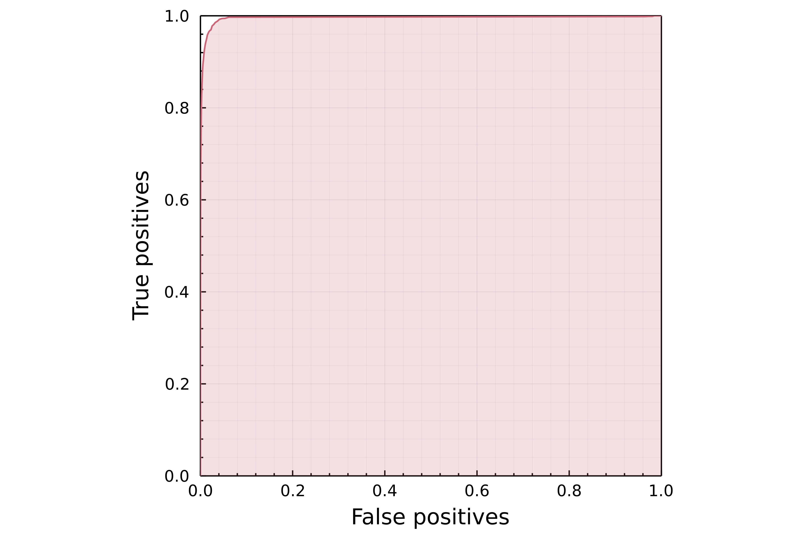
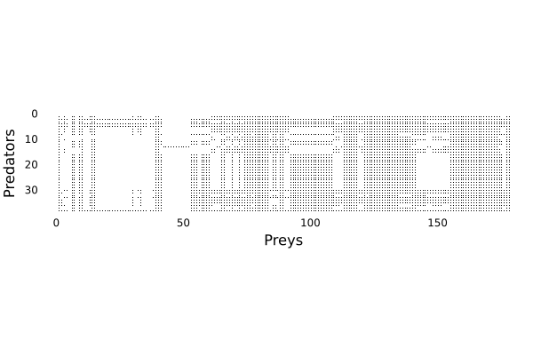
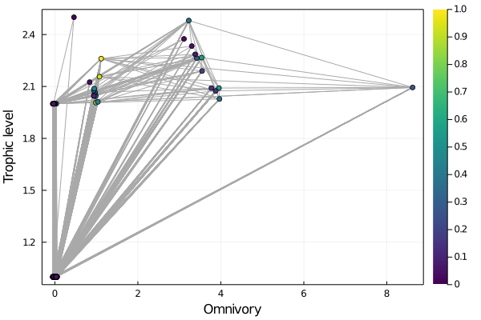

# Phylogenetic inference of ecological interactions through network embedding

**Executive summary**: 

1. network decomposition through a truncated-SVD capture the evolutionary signal of species interactions
2. the decomposition into left/right subspaces is unique, represents latent traits for resp. outgoing and incoming edges, and can be used to predict interactions
3. we can infer latent traits for unobserved species based on phylogenetic proximity with observed species
4. we use this information to transfer information from the trophic interaction of European mammals to Canadian mammals for which we have no *a priori* data

## Step 1 - data cleaning

We reconciled the names in the European metaweb to the GBIF taxonomic backone,
resulting in 260 species with an estimated 2342 trophic interactions. We then
reconciled the entire Upham *et al.* phylogenetic tree to the GBIF taxonomic
backbone, ensuring that we could merge the data.

## Step 2 - network embedding

We extracted the left and right subpsaces of a rank-5 t-SVD of the European
mammals metaweb. When multiplied, these two matrices give an approximation of
the network; we determined a threshold indicating that an interactions is likely
by fiding the value maximizing Youden's J statistic. At rank 5, this was approx.
0.11, giving J > 0.95.

The following plot is the ROC curve - it is entirely expected to see such a good
predictive accuracy, the point of this figure is simply to check that 5 ranks
are enough to get the interactions more than 95% right.

## Step 3 - target data

We downloaded a list of mammals having been observed in Canada at least
**twice** according to GBIF - this list includes fossils which are removed when
matched against the tree. We filtered out all marine mammals.

## Step 4 - latent traits inference

For all species in the Canadian pool that had also been reported in the European
metaweb, we kept their latent traits as is. For other species, we reconstructed
their latent traits by averaging the values of those of their 3 closest
neighbors (based on the cophenetic matrix of the entire tree). This ensure that
shared species are at the same position in both latent subspaces. 

## Step 5 - prediction

The prediction of interactions was done through a random dot product graph, by
multiplication of the infered left and right subspaces and thresholding at the
value estimated during step 2. This yiels a network with 223 species of mammals
and approx. 6000 interactions.

The top-ranked interactions are in the table below:

| predator         | prey               | evidence |
| ---------------- | ------------------ | -------- |
| Canis lupus      | Myodes glareolus   | 1.57     |
| Sus scrofa       | Mus musculus       | 1.38     |
| Vulpes vulpes    | Myodes glareolus   | 1.38     |
| Canis lupus      | Myodes gapperi     | 1.37     |
| Mustela erminea  | Microtus oeconomus | 1.37     |
| Felis silvestris | Mus musculus       | 1.33     |
| Mustela nivalis  | Mus musculus       | 1.32     |
| Mustela erminea  | Sorex minutissimus | 1.31     |
| Sus scrofa       | Sorex araneus      | 1.29     |

The "evidence" score is a relative ranking of interactions during the random dot
product graph step, and is not necessarily a measure of strength or likelihood
of the interaction.

## Step 6 - comparison

The following plots show the omnivory v. trophic level diagram for both the
Canadian (top) and European (bottom) mammal metawebs:

The species with the highest trophic levels in Canada are:

| Species          | gen. | vuln. | omnivory | level |
| ---------------- | ---- | ----- | -------- | ----- |
| Lynx lynx        | 182  | 0     | 3.75     | 3.04  |
| Ursus arctos     | 194  | 0     | 3.58     | 2.97  |
| Canis lupus      | 195  | 7     | 3.57     | 2.96  |
| Vulpes vulpes    | 194  | 15    | 4.64     | 2.95  |
| Canis latrans    | 194  | 7     | 4.64     | 2.95  |
| Panthera leo     | 126  | 0     | 2.20     | 2.50  |
| Panthera tigris  | 126  | 0     | 2.20     | 2.50  |
| Arctodus simus   | 139  | 0     | 2.09     | 2.46  |
| Ursus americanus | 139  | 0     | 2.09     | 2.46  |
| Gulo gulo        | 117  | 0     | 1.91     | 2.41  |

The species with the highest omnivory in Canada are:

| Species                 | gen. | vuln. | omnivory | level |
| ----------------------- | ---- | ----- | -------- | ----- |
| Sus scrofa              | 106  | 38    | 15.84    | 2.03  |
| Felis silvestris        | 87   | 15    | 15.81    | 2.04  |
| Mustela nigripes        | 87   | 42    | 15.81    | 2.04  |
| Mustela putorius        | 83   | 22    | 15.44    | 2.16  |
| Mustela vison           | 122  | 46    | 15.37    | 2.15  |
| Mustela frenata         | 122  | 46    | 15.37    | 2.15  |
| Vulpes lagopus          | 104  | 10    | 15.10    | 2.25  |
| Martes americana        | 117  | 19    | 15.07    | 2.27  |
| Eumetopias jubatus      | 109  | 5     | 15.00    | 2.29  |
| Mirounga angustirostris | 109  | 5     | 15.00    | 2.29  |

Note that some species are probably captive, and will be removed.